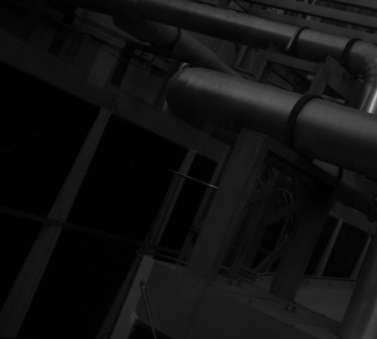

# CVPR2020-Polarized-Reflection-Removal-with-Perfect-Alignment
Code for CVPR2020 paper "Polarized Reflection Removal with Perfect Alignment in the Wild"

[paper](http://openaccess.thecvf.com/content_CVPR_2020/papers/Lei_Polarized_Reflection_Removal_With_Perfect_Alignment_in_the_Wild_CVPR_2020_paper.pdf) | [project website](https://chenyanglei.github.io/polar_rr/index.html) 

 

## Fast Demo (TL;DR)
```
git clone https://github.com/ChenyangLEI/polarization-reflection-removal
cd polarization-reflection-removal
conda env create -f environment.yml
conda activate PolarRR
bash download.sh
mkdir result
mv Submission_ckpt result
python final_infer.py --task Submission_ckpt --test_dir demo
```
The results are placed in ./test_result


## PolarRR Dataset
Please download the dataset on [Google Drive](https://drive.google.com/file/d/1iRHs23jSOfim-toWXqwJJ3CaTWUHSaYF/view?usp=sharing), 
there are 807 pairs of polarization images. In each pair of images, the first one is the mixed image, the second one is the reflection images.
```
bash download_data.sh
```

## Setup

### Environment
This code is based on tensorflow. It has been tested on Ubuntu 18.04 LTS.

Anaconda is recommended: [Ubuntu 18.04](https://www.digitalocean.com/community/tutorials/how-to-install-the-anaconda-python-distribution-on-ubuntu-18-04)
| [Ubuntu 16.04](https://www.digitalocean.com/community/tutorials/how-to-install-the-anaconda-python-distribution-on-ubuntu-16-04)

After installing Anaconda, you can setup the environment simply by

```
conda env create -f environment.yml
```

### Download checkpoint and VGG model

Download the ckpt and VGG model from the [Google drive](https://drive.google.com/file/d/1-asHTZWagCemCIZmMAXCAjIhtvpMaV59/view), put them in the correct path:

VGG_Model/imagenet-vgg-verydeep-19.mat

ckpt/Submission_ckpt/checkpoint


## Inference
```
python final_infer.py --task Submission_ckpt --test_dir demo
```

The results are placed in ./test_result

## Key designs
### 1. Polarization information
To be able to relax the assumptions about the appearance of reflection, we leverage polarization that inherently exists in almost all reflected light.
### 2. Perfect-alignment real-world data 
We first identify the misalignment issues of existing reflection removal datasets where the collected reflection-free images are not perfectly aligned with input mixed images due to glass refraction. To address this issue, we design a new data collection pipeline called M-R, which helps us collect diverse real-world data with perfect alignment by utilizing glass in the real world.
### 3. Two-stage framework for reflection removal
We propose a two-stage framework for reflection removal from polarized images. Our approach firstly estimates reflection, with which it infers the transmission image secondly. This framework helps us improve 2dB PSNR on our real-world dataset.


## Citation
If you find this work useful for your research, please cite:
```
@InProceedings{Lei_2020_CVPR,
author = {Lei, Chenyang and Huang, Xuhua and Zhang, Mengdi and Yan, Qiong and Sun, Wenxiu and Chen, Qifeng},
title = {Polarized Reflection Removal With Perfect Alignment in the Wild},
booktitle = {IEEE/CVF Conference on Computer Vision and Pattern Recognition (CVPR)},
month = {June},
year = {2020}
}
```

## Contact
Please contact me if there is any question (Chenyang Lei, leichenyang7@gmail.com)
